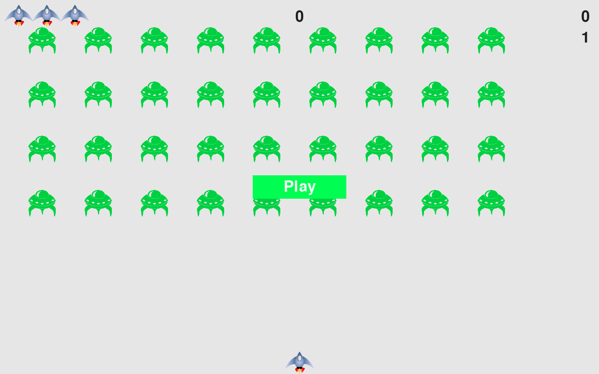

# Alien_Invasion
 


## How to Run

1. In the command prompt run ``` pip install pygame```.
2. Navigate to the ```Alien_Invasion``` directory.
3. Run ```python alien_invasion.py``` or ```python3 alien_invasion.py```.


## Description

In **Alien Invasion**, the player controls a rocket ship that appears at the bottom center of the screen. The player can move the ship right and left using the arrow keys and shoot bullets using the spacebar. When the game begins a fleet of aliends fills the sky and moves across and down the screen. The player shoots and destroys the aliens. If the player shoots all the aliends, a new fleet appears that moves faster than the previous fleet. If any alien hits the player's ship or reached the bottom of the screen, the player loses a ship. If the player loses three ships, the game ends.
